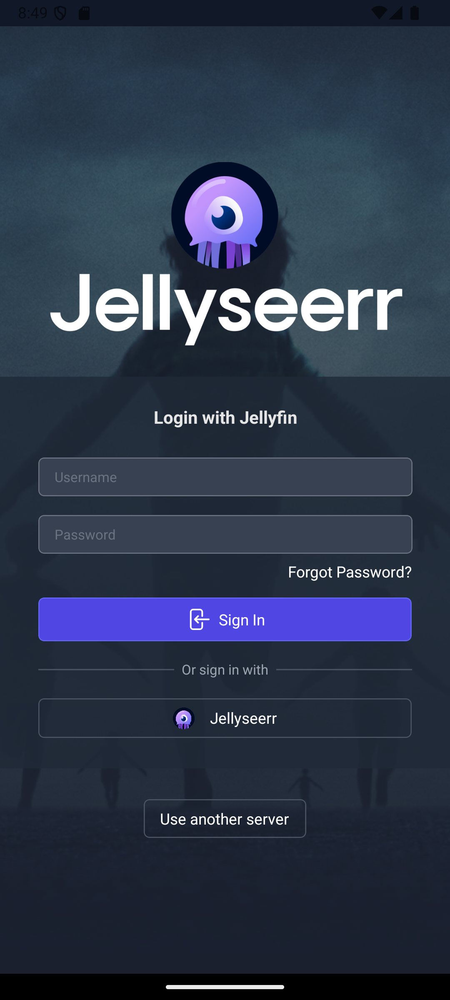
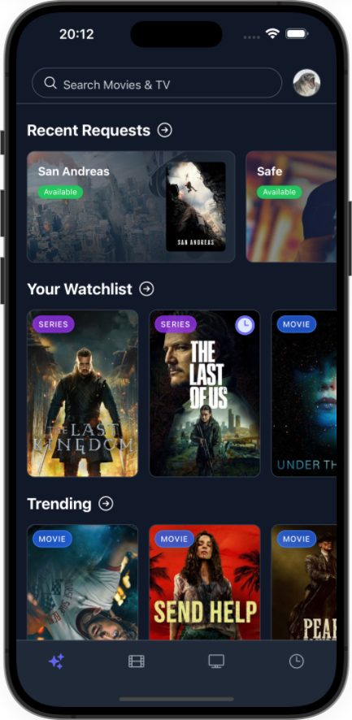

<p align="center">

</p>

This project contains the source code of the Seerr mobile app. This app is built using React Native and Expo, and is mostly a rewrite of the original Seerr web app to create a more user-friendly experience on mobile devices, and try to port it to TV devices.

## Get started

1. Install dependencies

   ```bash
   npm install
   ```

2. Prebuild the project

   ```bash
   npm run prebuild
   ```

3. Start the development server

   ```bash
   npm start
   ```

## Todo

- [x] i18n support
- [x] More settings in advanced request modal
- [x] TV shows seasons details
- [ ] Filters in discover pages
- [x] Add movie collections
- [x] Support for Plex
- [x] Support for iOS
- [ ] Support for TV devices

## Screenshots

| Select Server                                  | Login                             | Homepage                                |
| ---------------------------------------------- | --------------------------------- | --------------------------------------- |
|  |  |  |

| Movie Details                                     | Search                              | Request Modal                                     |
| ------------------------------------------------- | ----------------------------------- | ------------------------------------------------- |
|  |  |  |

| Also available for iOS!           |
| --------------------------------- |
|  |

## License

This project is licensed under the MIT License - see the [LICENSE](LICENSE) file for details.
