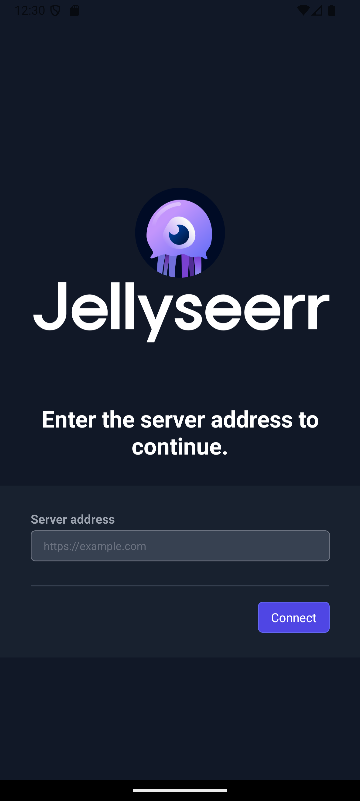
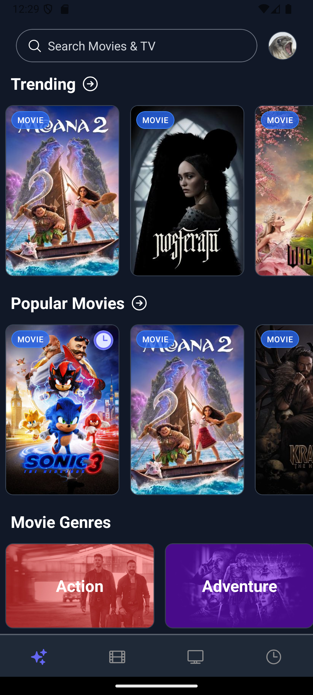
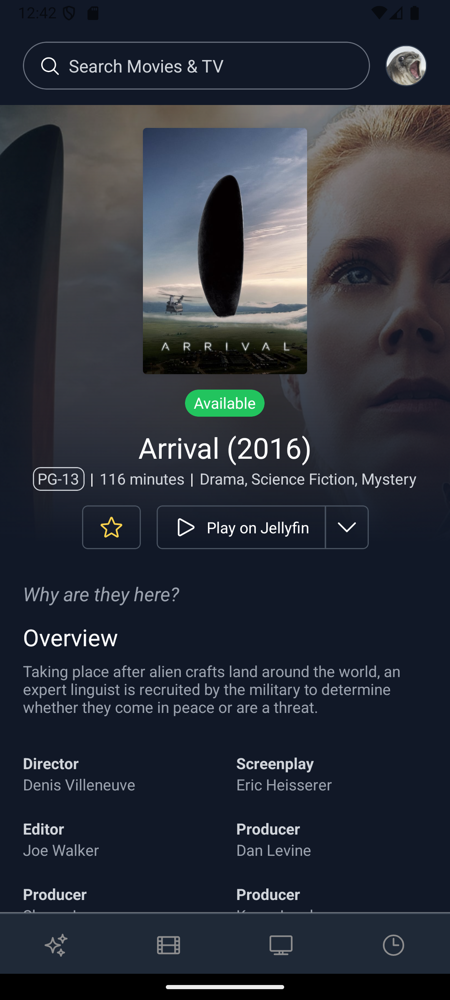
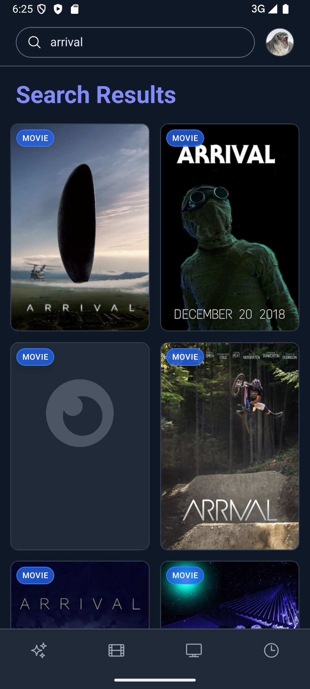
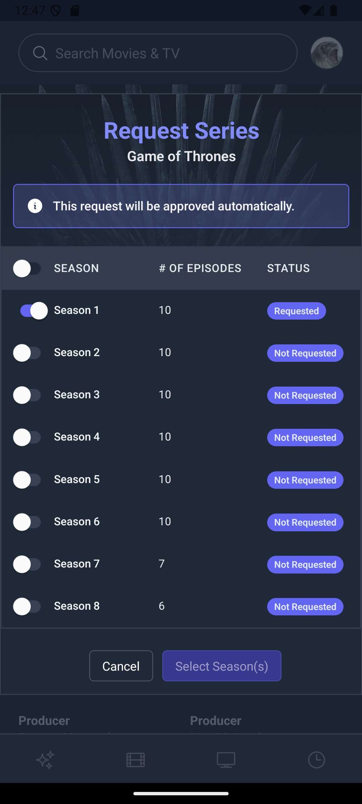
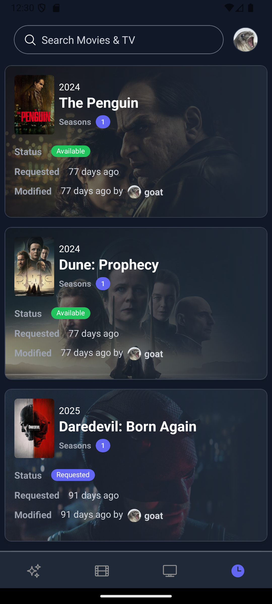

<p align="center">

</p>

This project contains the source code of the Jellyseerr mobile app. This app is built using React Native and Expo, and is mostly a rewrite of the original Jellyseerr web app to create a more user-friendly experience on mobile devices, and try to port it to TV devices.

## Get started

1. Install dependencies

   ```bash
   npm install
   ```

2. Prebuild the project

   ```bash
   npm run prebuild
   ```

3. Start the development server

   ```bash
   npm start
   ```

## Todo

- [ ] i18n support
- [ ] Tags and user override in advanced request modal
- [ ] TV shows seasons details
- [ ] Filters in discover pages
- [x] Add movie collections
- [ ] Support for Plex
- [ ] Support for iOS
- [ ] Support for TV devices

## Screenshots

| Select Server                                  | Homepage                                | Movie Details                                     |
| ---------------------------------------------- | --------------------------------------- | ------------------------------------------------- |
|  |  |  |

| Search                              | Request Modal                                     | Request List                                    |
| ----------------------------------- | ------------------------------------------------- | ----------------------------------------------- |
|  |  |  |

## License

This project is licensed under the MIT License - see the [LICENSE](LICENSE) file for details.
