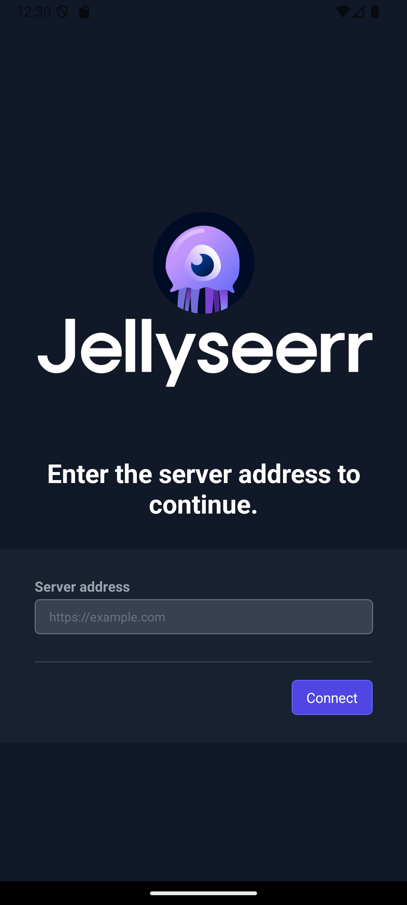
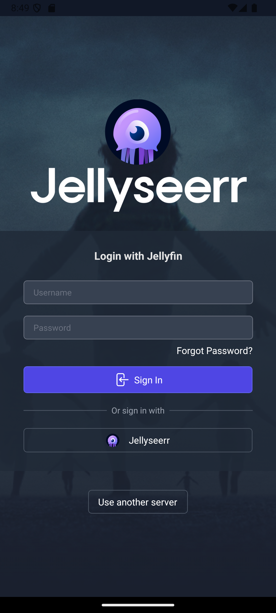
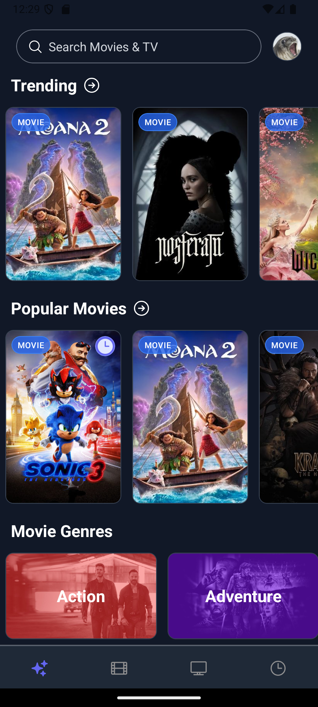
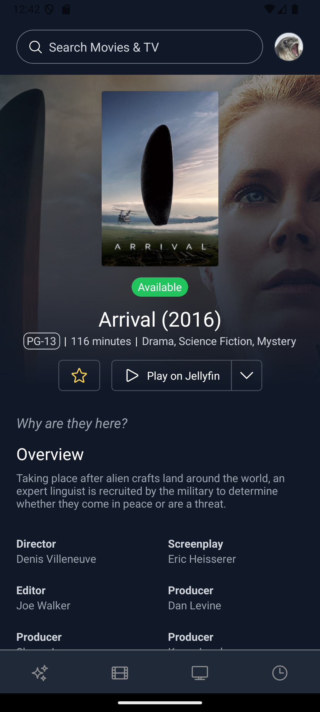
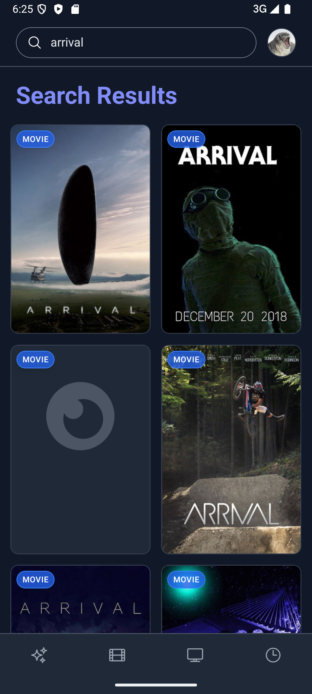
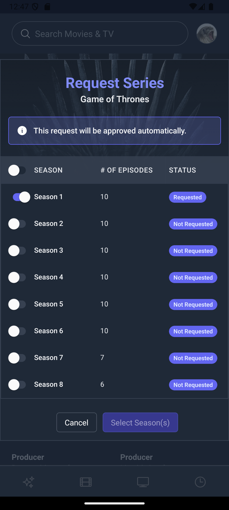
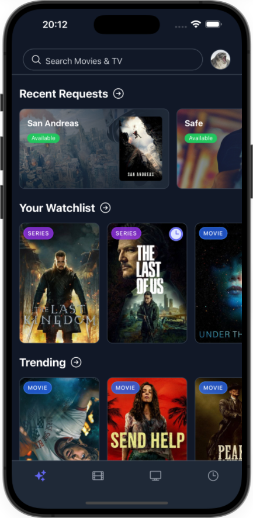
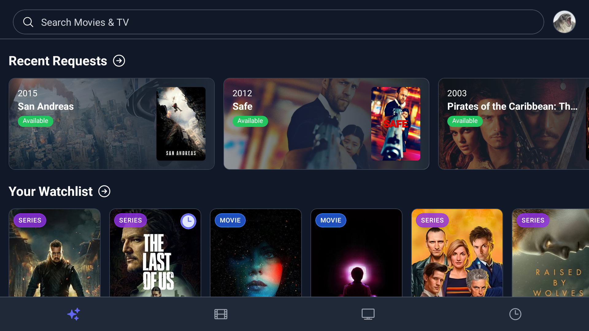

<p align="center">

</p>

# Seerr Mobile App

**Seerr** is a free and open source software application for managing requests for your media library. It integrates with the media server of your choice: [Jellyfin](https://jellyfin.org), [Plex](https://plex.tv), and [Emby](https://emby.media/). In addition, it integrates with your existing services, such as **[Sonarr](https://sonarr.tv/)**, **[Radarr](https://radarr.video/)**.

This project contains the source code of the Seerr mobile app. This app is built using React Native and Expo, and is mostly a port of the original Seerr web app to create a more user-friendly experience on mobile and TV devices.

> ⚠️ **Early Development Notice**
>
> This app is still in early development and may contain bugs or missing features.
>
> Feel free to report any issues you may encounter!

The app is not yet available on the app stores, but you can run it on your devices by installing the builds available in the [Releases](https://github.com/seerr-team/mobile-app/releases).

The process of publishing on the app stores is currently being worked on, and it will be available in the near future.

## Current Features

The complete list of features is available in the main [Seerr repository](https://github.com/seerr-team/seerr?tab=readme-ov-file#current-features).
The mobile app offers almost all the features of the web app, with some additional features and improvements:

- [x] i18n support
- [x] More settings in advanced request modal
- [x] TV shows seasons details
- [x] Add movie collections
- [x] Support for Plex
- [x] Support for iOS
- [x] Support for TV devices
- [ ] Filters in discover pages
- [ ] Block media from the app

## Preview

<table>
  <tr>
    <th width="33%">Select Server</th>
    <th width="33%">Login</th>
    <th width="33%">Homepage</th>
  </tr>
  <tr>
    <td></td>
    <td></td>
    <td></td>
  </tr>
</table>
<table>
  <tr>
    <th width="33%">Movie Details</th>
    <th width="33%">Search</th>
    <th width="33%">Request Modal</th>
  </tr>
  <tr>
    <td></td>
    <td></td>
    <td></td>
  </tr>
</table>

### Also available for iOS and TV devices!

<table>
  <tr>
    <th width="25%">Seerr for iOS</th>
    <th width="75%">Seerr for TV</th>
  </tr>
  <tr>
    <td></td>
    <td></td>
  </tr>
</table>

## Contributing

1. Install dependencies

   ```bash
   npm install
   ```

2. Prebuild the project

   ```bash
   # For mobile devices
   npm run prebuild
   # For TV devices
   npm run prebuild:tv
   ```

3. Start the development server

   ```bash
   # For Android devices
   npm run android
   # For iOS devices
   npm run ios
   # For Android TV devices
   npm run android:tv
   # For Apple TV devices
   npm run ios:tv
   ```

## License

This project is licensed under the MIT License - see the [LICENSE](LICENSE) file for details.
